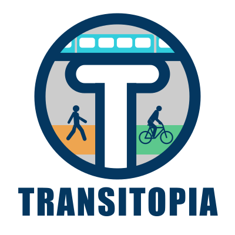
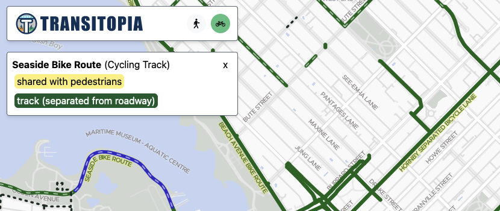

# Transitopia

Transitopia is a mapping project that aims to provide high-quality **public transit**, **cycling**, and **pedestrian** infrastructure maps. The goal is to promote best practices and celebrate high quality infrastructure, while calling attention to unsafe and low-quality infrastructure.

**Current status** (Aug 2025): We are working on **micromobility** maps for British Columbia. **Transit** and **Pedestrian** maps will come in the future.

Online at: **[www.transitopia.org](https://www.transitopia.org/cycling)**.

## This repository

This repository is a monorepo containing most of the parts you need to run and develop Transitopia locally. It consists of:

* `web-ui`: The Single Page Application implements the website with the Transitopia map, seen at https://www.transitopia.org/
* `map-layers`: A Transitopia profile for [Planetiler](https://github.com/onthegomap/planetiler) that generates our unique map layers/overlays, like the micromobility (cycling) map.

## How to run Transitopia Locally

1. You need Node.js on your system (and optionally Java 21+ if you want to build the maps yourself).
2. Clone this repo to your system.
3. Get the vector base map tiles file:
   - Option 1: Download. Go to [Transitopia Base Map Releases](https://github.com/transitopia/planetiler-openmaptiles/releases), find the most recent release, and download `transitopia-base-bc.pmtiles`. Copy it into this repo's `public` folder.
   - Option 2: Build it yourself. Use the [Transitopia planetiler-openmaptiles](https://github.com/transitopia/planetiler-openmaptiles) repository to generate the `transitopia-base-bc.pmtiles` vector map data file using planetiler (see that repo's README). Copy the resulting map data file into this repo: `cp ../planetiler-openmaptiles/data/transitopia-base-bc.pmtiles public/transitopia-base-bc.pmtiles`.
4. Get the vector overlay tiles file: this contains the cycling paths, pedestrian paths, etc. and is specific to Transitopia.
   - Option 1: Download. Go to [this page](https://github.com/transitopia/planetiler-transitopia/actions/workflows/build_cycling.yml?query=event%3Aschedule), select the latest run, then click on `compiled-maps` to download the .zip file with the vector overlays. Unzip it, then copy the resulting map data file into this repo as e.g. `cp ~/downloads/transitopia-cycling-british-columbia.pmtiles map-layers/data/`.
   - Option 2: Build it yourself. Use the `map-layers` folder in this repository to generate the `transitopia-cycling-british-columbia.pmtiles` vector map data file using planetiler. See [the README](./map-layers/README.md) for instructions.
5. Install dependencies: `npm install`
6. Run the development server: `npm run dev`
7. Go to http://localhost:5173/ in your browser.

## Credits

Transitopia is a project by [Braden MacDonald](https://www.bradenmacdonald.com) ([@bradenmacdonald](https://github.com/bradenmacdonald) on GitHub).

All source code is open source and all data is open data, but the licenses vary.

The primary source of map data is [OpenStreetMap](https://www.openstreetmap.org/). Vector map tiles are generated using [planetiler](https://github.com/onthegomap/planetiler) - see the `map-layers` folder for all the details on how the map is generated.

The map is rendered using [MapLibre GL](https://maplibre.org/).

Map vector tile data is stored in the [PMTiles](https://github.com/protomaps/PMTiles) format.

The base map style is a customized version of [OpenMapTiles Positron](https://github.com/openmaptiles/positron-gl-style), and the base map is [a customized version of OpenMapTiles](https://github.com/transitopia/planetiler-openmaptiles).
