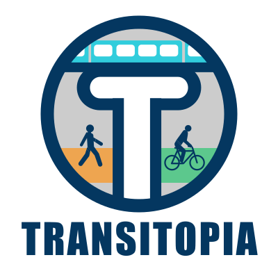
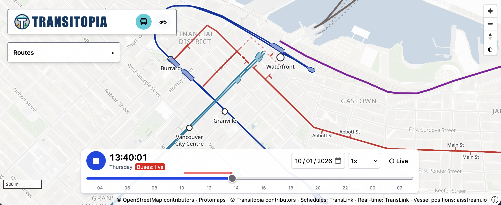

# Transitopia



Transitopia is a mapping project that aims to provide high-quality **public transit**, **cycling**, and **pedestrian** infrastructure maps. The goal is to promote best practices and celebrate high quality infrastructure, while calling attention to unsafe and low-quality infrastructure.

**Current status** (Oct 2026): The first release of **our real-time transit map is in beta** for Metro Vancouver, showing only Translink's "Fast & Frequent" network. Also available is the **cycling / micromobility map** for all of British Columbia.

Online at: **[www.transitopia.org](https://www.transitopia.org/)**.



## This repository

This repository is a monorepo (npm workspaces) containing most of the parts you need to run and develop Transitopia locally:

* `apps/web`: the Single Page Application that implements the website with the Transitopia map, seen at https://www.transitopia.org
* `apps/server`: the real-time service: it polls available data feeds (GTFS Realtime, AIS, etc.), streams the data to the web app, adheres to rate limits, records history, and re-dispatches trains live.
* `packages/transit-core`: the DOM-free transit engine: GTFS, the SkyTrain track graph, run inference, a signalling-aware train dispatcher, playback, corrections, and bus prediction.
* `packages/transit-map`: the transit map engine (clock, playback, WebGL vehicle layers), mounted by the website on `/transit`.
* `packages/db`: the server's PostgreSQL migrations and types.
* `packages/map-style`: the site's basemap style (Protomaps, light and dark).
* `packages/shared`: definitions shared by the website and server, such as the dataset registry behind the map's credits.
* `pipelines`: build-time data pipelines and validators.
* `regions/metro-vancouver`: curated data for Metro Vancouver (config, track infrastructure, scenarios, observations and disruptions).
* `map-layers`: A Transitopia profile for [Planetiler](https://github.com/onthegomap/planetiler) that generates our unique map layers/overlays (currently just the cycling/micromobility map).

How it all fits together is in [docs/DESIGN.md](docs/DESIGN.md), with each part's design in its own folder. [CLAUDE.md](CLAUDE.md) lists every command. Planned work is in [GitHub issues](https://github.com/transitopia/transitopia/issues).

## How to run Transitopia locally

You need Node.js 24+ (and optionally Java 21+ if you want to build the cycling maps yourself). Clone this repo, then run `npm install` at its root.

1. Build the basemap (a British Columbia extract of the [Protomaps](https://protomaps.com/) daily build, about 2 GB, plus its fonts and icons):

   ```sh
   npm run tiles -- --region bc
   ```

2. For the cycling map, get the vector overlay tiles file: this contains the cycling paths, bike parking, etc. and is specific to Transitopia.
   - Option 1: Download. Go to [this page](https://github.com/transitopia/transitopia/actions/workflows/build_cycling.yml?query=event%3Aschedule), select the latest run, then click on `compiled-maps` to download the .zip file with the vector overlays. Unzip it, then copy `transitopia-cycling-british-columbia.pmtiles` into this repo's `apps/web/public/` folder.
   - Option 2: Build it yourself. Use the `map-layers` folder in this repository to generate the `transitopia-cycling-british-columbia.pmtiles` vector map data file using planetiler. See [the README](./map-layers/README.md) for instructions.
3. For the transit map, build the timetable and train data:

   ```sh
   npm run data:gtfs       # fetch the latest GTFS feed and build the timetable data
   npm run build:infra     # publish the track network and platform mapping
   npm run build:movements # infer train runs and dispatch them, per day type
   ```

4. Run the development server with `npm run dev`, then go to http://localhost:5173/ in your browser.

Downloads and build output go to `var/` (gitignored). The track network itself is committed (`regions/metro-vancouver/infrastructure/`), and `npm run data:osm` re-imports it from OpenStreetMap.

The site shows transit schedules only (*estimated* positions) unless it's pointed at an RT service: run `npm run server` and start the site with `VITE_TRANSIT_API=http://localhost:8787/ npm run dev`. A local server doesn't poll TransLink or aisstream.io (even with API keys) unless started with `RT_POLL=1`: TransLink allows 1,000 requests a day per key, and the production server spends them (see [docs/DESIGN.md → Upstream request budget](docs/DESIGN.md#upstream-request-budget)). To see live data locally, start it with `RT_FORWARD_TO=https://api.transitopia.org`, or point the site straight at production with `VITE_TRANSIT_API=https://api.transitopia.org/ npm run dev`.

## Credits

Transitopia is a project by [Braden MacDonald](https://www.bradenmacdonald.com) ([@bradenmacdonald](https://github.com/bradenmacdonald) on GitHub).

All source code is open source and all data is open data, but the licenses vary.

The primary source of map data is [OpenStreetMap](https://www.openstreetmap.org/). The basemap is built from the [Protomaps](https://protomaps.com/) daily build of OpenStreetMap, styled with [Protomaps basemaps](https://github.com/protomaps/basemaps) in light and dark flavours. Custom vector map tiles are generated using [planetiler](https://github.com/onthegomap/planetiler) - see the `map-layers` folder.

The map is rendered using [MapLibre GL](https://maplibre.org/).

Map vector tile data is stored in the [PMTiles](https://github.com/protomaps/PMTiles) format.

Transit data sources:
* [TransLink GTFS static and GTFS Realtime](https://www.translink.ca/about-us/doing-business-with-translink/app-developer-resources/gtfs/gtfs-realtime). Some of the data used in this product or service is provided by permission of TransLink. TransLink assumes no responsibility for the accuracy or currency of the Data used in this product or service. This is not an official TransLink product, and train positions are estimates.
* [AIS Stream](https://aisstream.io/) provides marine vessel movements.
